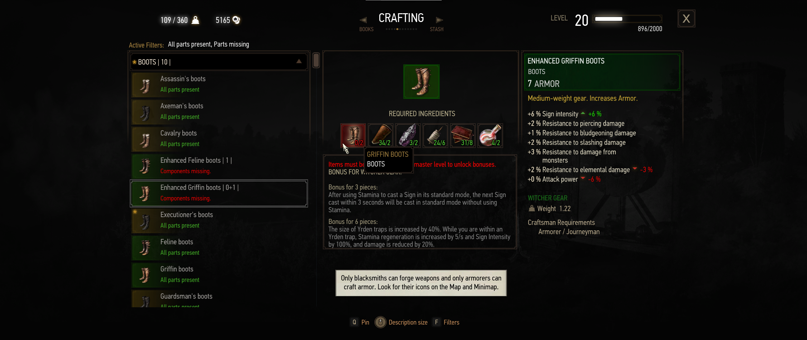

<a href="https://www.youtube.com/watch?v=S9fPDVx_Js0">Increased materials requirement<a/>

# Features
A incredibly small mod that increases the amount of materials you have to spend when crafting. This includes swords and armors as well, which means that to improve your gear to the superior version, you will need two sets of the enhanced gear.

Why, you're asking? It's a different approach to the economy "balancing" that mods often do. This mod is much simpler in its approach and design but it has a few advantanges:
- You have to craft twice more, and so you spend more crowns on the process. Thus spending some of the huge pile of crowns you saved during your adventure.
- Instead of reducing the amount of loot to almost 0 it forces you to use the crafting feature more, which was almost unused before
- You'll mostly spend your materials & crowns when crafting high level witcher gear during the end game, where you usually have more crowns. This means the mod integrates well mid-playthrough and is also low level friendly
- Because it asks you to craft low level gear to craft high level gear, it gives a purpose to otherwise useless low level materials even in end-game
- Everything revolves around monster ingredients now and no longer crowns. The game won't ask you to farm & sell swords on repeat as the crowns won't help you much in gathering these materials (unless you intend to buy the materials at an exhuberant price). Killing monsters is now the main source of crafting materials
- If you lack materials, you can always buy them to merchants. You can still use crowns if that's what you like, although you will have less crowns to spend after using the mod for a long time.

This mod doesn't pretend to fix the entire economy by itself, and so it fits perfectly with other economy mods. It is also compatible with pretty much anything, if you have mods that add new crafting recipes they will be affected too.

__There is no mod menu to control how much the requirements were increased__ (it's a 100% increase by default), the mod is so small it doesn't deserve to occupy an entry in the menu. If you wish to change that value, open `/modIncreaseMaterialsRequirement/scripts/content/local/increaseMaterialCost/material_multiplier.ws` and look `return 2;` replace the `2` by whatever number you'd prefer.

# Installing
 - download the latest version of this mod
- confirm you now have a zip archive with a folder named `modIncreasedMaterialsRequirement` in it
 - drop the `modIncreasedMaterialsRequirement` folder in your mods folder
 - confirm you now have a `modIncreasedMaterialsRequirement` folder in your mods folder
 - open the script merger of your choice and start merging. Few unresolved conflicts should appear as i kept them to the minimum, everything should auto-merge
 - load a save, open the crafting panel and confirm any witcher gear of enhanced quality now requires 2 sets of the basic version